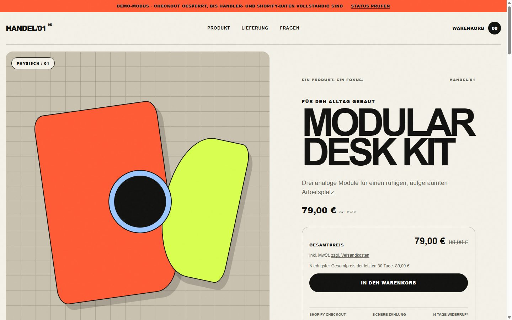
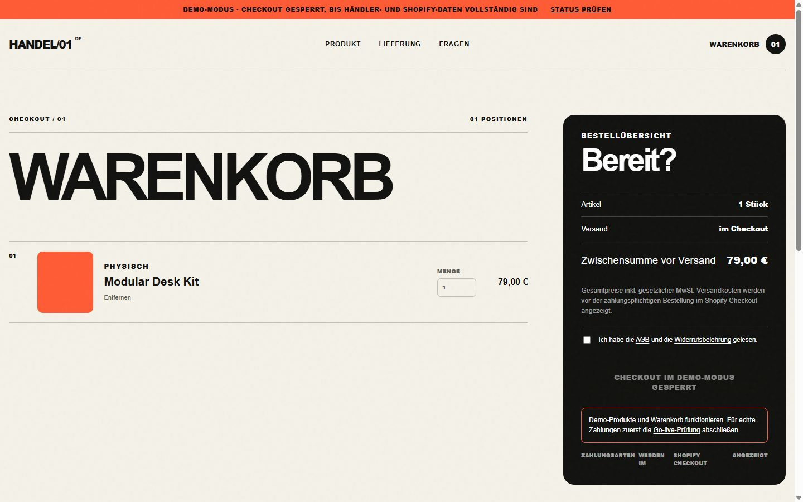
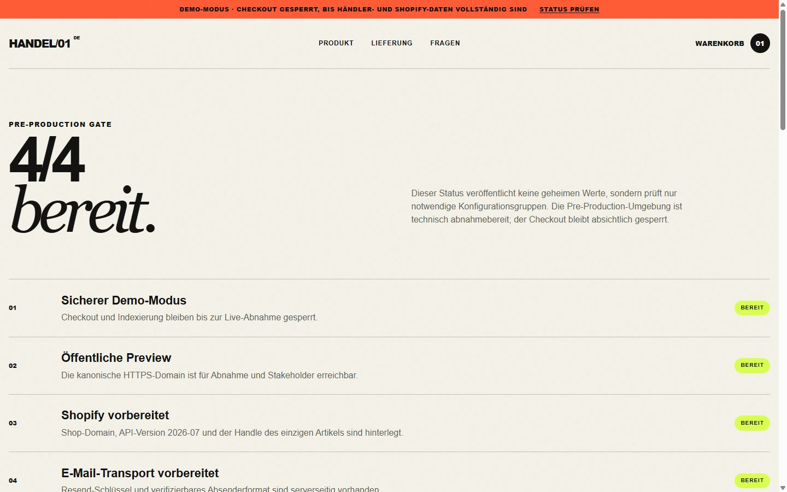
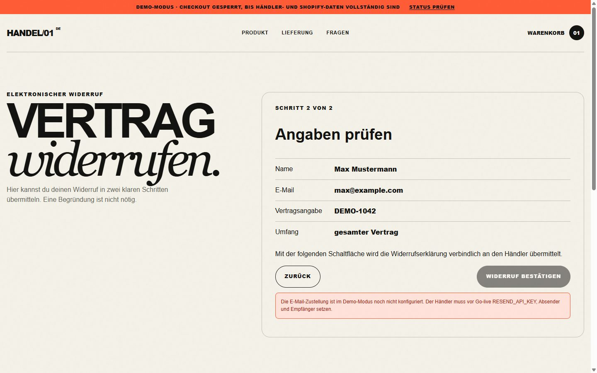
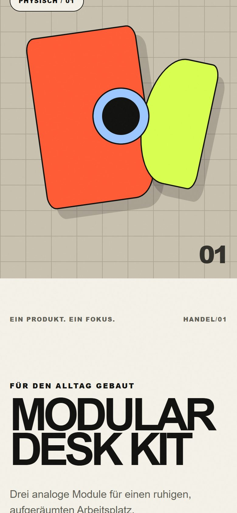

# HANDEL/01

Headless Shopify-Starter für **genau einen Artikel**. Next.js 16 auf Vercel, Storefront API `2026-07`, gebaut für den deutschen Rechtsrahmen — nicht als Theme-Klon, sondern als produktionsreifes Fail-safe-System.

**Ein Produkt. Klar erklärt. Checkout erst, wenn es wirklich soweit ist.**

[](https://github.com/d0npedro/handel-01-shopify-starter/actions/workflows/ci.yml)
[](LICENSE)
[](https://nextjs.org)
[](https://shopify.dev/docs/api/storefront)
[](https://handel-01-shopify-starter.vercel.app)

| | |
|---|---|
| Live-Demo | [handel-01-shopify-starter.vercel.app](https://handel-01-shopify-starter.vercel.app) |
| Status | [Pre-Production-Gate](https://handel-01-shopify-starter.vercel.app/startklar) |
| Stack | Next.js 16 · React 19 · TypeScript · Vercel |
| Quelle | Shopify Storefront API, Demo-Katalog nur bei `SHOP_MODE=demo` |



Die Landingpage bündelt Hero, Kaufbox, Nutzen, Lieferung, Pflichtangaben, FAQ und den finalen Kaufimpuls. `/shop` und alte Produktdetail-URLs leiten kanonisch auf `/`. Der sichtbare Artikel kommt ausschließlich aus `SINGLE_PRODUCT_HANDLE`.

---

## Was das Template beweist

Die meisten Headless-Shops zeigen eine Produktkarte. Dieses Repository zeigt die **Entscheidungsschicht davor**: was live darf und was bewusst nicht.

| Entscheidung | Umsetzung |
|---|---|
| Ein Fokus statt Katalog-Theater | Eine Landingpage, ein Handle, keine Ablenkung |
| Demo ist kein halber Live-Shop | `SHOP_MODE=demo` sperrt Checkout und `robots.txt` |
| Technik ≠ Go-live | `/startklar` trennt Pre-Production von Production |
| Recht ist Produkt-UI | Zweistufiger Widerruf, Digital-Consents, GPSR-Felder |
| Secrets bleiben server-only | Kein `NEXT_PUBLIC_`-Token, Consent vor jedem Pixel |

Unterstützte Produktarten über `custom.product_kind`:

- physische Ware mit Lieferzeit, Hersteller und GPSR-Sicherheit
- herunterladbare Skripte
- gekennzeichnete, generierte Musik inkl. Lizenz
- Software mit Systemanforderungen und Update-Hinweisen

---

## Oberfläche

### Warenkorb mit harter Demo-Sperre



Der Client führt den Warenkorb lokal. Checkout läuft nur über `/api/checkout`: Same-Origin, JSON-Limit, `assertCheckoutReady`, ausschließlich der konfigurierte Artikel, danach `cartCreate` auf Shopify. Im Demo-Modus bleibt der Button gesperrt — das ist Absicht, kein fehlendes Feature.

### Pre-Production-Gate



`/startklar` und `/api/health` veröffentlichen **keine** Secrets. Sie prüfen Konfigurationsgruppen. Ein grünes Pre-Production-Gate lockert `assertCheckoutReady` nicht.

### Elektronischer Widerruf



`/vertrag-widerrufen` folgt dem zweistufigen Ablauf. Die Labels **Vertrag widerrufen** und **Widerruf bestätigen** sind gesetzlicher UI-Text. Ohne Resend bleibt die zweite Stufe sichtbar deaktiviert.

### Mobile



---

## Sicherheitsmodell

```text
SHOP_MODE=demo          Storefront + Warenkorb an, Checkout aus, noindex
npm run verify:preprod  Preview, API-Version, Handle, E-Mail-Transport
npm run verify:config   Live-Gate — darf in der Demo fehlschlagen
SHOP_MODE=live          erst nach Runbook, Testbestellungen, manuellen Gates
```

`assertCheckoutReady` in `src/lib/config.ts` ist die letzte Sperre vor `cartCreate`. Physischer Versand braucht zusätzlich `LEGAL_LUCID_NUMBER`. Digitale Inhalte brauchen zwei getrennte ausdrückliche Zustimmungen als Cart Attributes:

- Beginn der Bereitstellung vor Ablauf der Widerrufsfrist
- Kenntnis vom Erlöschen des Widerrufsrechts

Die enthaltenen Rechtstexte sind strukturierte Muster, keine Rechtsberatung. Sie müssen auf Unternehmen, Sortiment, Apps und Märkte angepasst werden. Die Demo-Warnung bleibt, solange Platzhalter-Händlerdaten gesetzt sind.

Vollständig: [docs/architecture.md](docs/architecture.md) · [docs/GO_LIVE_DE.md](docs/GO_LIVE_DE.md)

---

## Lokal starten

Voraussetzungen: Node.js 22.x und npm.

```powershell
Copy-Item .env.example .env.local
npm install
npm run dev
```

Danach: [http://localhost:3000](http://localhost:3000)

```powershell
npm run check
npm run verify:preprod
npm run verify:config
```

`verify:preprod` bestätigt den sicheren Demo-Modus, eine öffentliche HTTPS-Preview, Shopify-Domain/API-Version, den Einzelartikel, den serverseitigen E-Mail-Transport, die Ein-Produkt-Routen und die Social Preview.

---

## Shopify verbinden

1. Shop anlegen, Vertriebskanal **Headless** installieren, Storefront erzeugen.
2. Domain, privaten Storefront-Token und `SINGLE_PRODUCT_HANDLE` in `.env.local` setzen.
3. Demo-Artikel aus [shopify/demo-products.csv](shopify/demo-products.csv) importieren oder einen eigenen Artikel anlegen.
4. Metafelder gemäß [shopify/METAFIELDS.md](shopify/METAFIELDS.md) befüllen.
5. Digitale Varianten als nicht physisch markieren (`requiresShipping=false`).
6. Digital Products oder eine Download-/Lizenz-App einrichten; verifizierter Demo-Stand: [docs/DEMO_FULFILLMENT.md](docs/DEMO_FULFILLMENT.md).
7. Markets: Deutschland, EUR. Steuer- und Versandprofile prüfen.

`public/og.png` beim Produktwechsel ersetzen. Hat der Shopify-Artikel ein Featured Image, nutzt die Landingpage dieses automatisch.

API-Version: `2026-07`. Shopify veröffentlicht vierteljährlich eine neue stabile Version — mindestens einmal pro Quartal prüfen.

---

## Elektronischer Widerruf

`/vertrag-widerrufen` sendet Inhalt, Datum, Uhrzeit und Referenz gleichzeitig an Händler und Verbraucher.

```env
RESEND_API_KEY=...
REVOCATION_EMAIL_FROM=widerruf@deine-domain.de
LEGAL_EMAIL=service@deine-domain.de
```

Ohne diese Werte ist die Übermittlung sichtbar deaktiviert. Vor Livegang Absenderdomain verifizieren und echte Zustellung testen.

---

## Vercel

Alle Variablen aus `.env.example` im Projekt setzen. Zuerst Demo deployen, Domain und Seiten prüfen, danach die Live-Gates.

```powershell
vercel deploy -y
vercel deploy --prod -y
```

---

## Repository

```text
src/app/                 App Router, Legal Pages, APIs
src/components/          Kauf, Warenkorb, Consent, Widerruf
src/lib/                 Shopify, Gates, Validierung
shopify/                 CSV, Metafelder, Demo-Assets
docs/                    Architektur, Runbook, Screenshots
scripts/                 Pre-Production- und Live-Gates
tests/                   dependency-freie Vertragsprüfungen
.github/workflows/ci.yml Lint, Types, Tests, verify:preprod, Build
```

Index: [docs/README.md](docs/README.md)

Der Code ersetzt keine Händlerregistrierung, keine LUCID-Systembeteiligung, keine Rechtsberatung und keine Zahlungsanbieter-Freischaltung. `/startklar` und das Runbook trennen technische Bereitschaft von externen Pflichten.

---

## Mitmachen

Siehe [CONTRIBUTING.md](CONTRIBUTING.md) und [SECURITY.md](SECURITY.md).

## Lizenz

[MIT](LICENSE)
